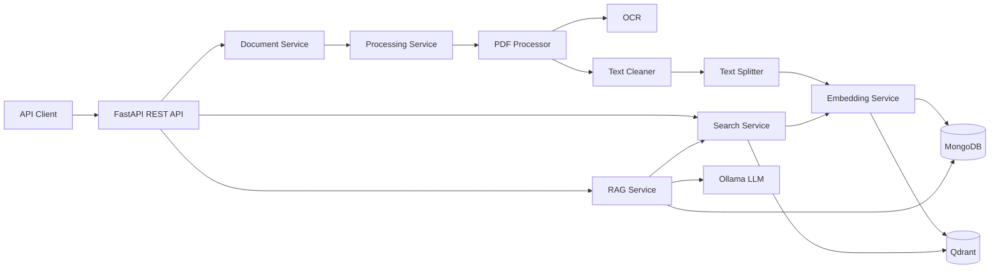

# Document Intelligence Platform

An AI-powered backend platform for processing, searching, and interacting with PDF documents using semantic search and Retrieval-Augmented Generation (RAG).

## Table of Contents

- [Project Overview](#project-overview)
- [Motivation](#motivation)
- [Key Features](#key-features)
- [System Architecture](#system-architecture)
- [Document Processing Pipeline](#document-processing-pipeline)
- [Semantic Search](#semantic-search)
- [Retrieval-Augmented Generation](#retrieval-augmented-generation)
- [Technology Stack](#technology-stack)
- [Project Structure](#project-structure)
- [Current Status](#current-status)
- [Installation](#installation)
- [API Overview](#api-overview)
- [Future Directions](#future-directions)

## Project Overview

Document Intelligence Platform is an AI-powered backend application designed to process PDF documents and transform their content into searchable knowledge.

The platform provides a complete document processing and retrieval pipeline. PDF files are uploaded through a REST API, their text is extracted and cleaned, the content is divided into structured chunks, and vector embeddings are generated for semantic retrieval.

The generated embeddings are stored in Qdrant, enabling similarity-based semantic search across document content.

The platform also implements a Retrieval-Augmented Generation (RAG) pipeline that retrieves relevant document sections and provides them as context to a Large Language Model running locally through Ollama.

The project focuses on backend architecture and AI document processing rather than providing a graphical user interface.

## Motivation

Large amounts of useful information are often stored inside documents such as reports, technical documentation, research papers, contracts, and other PDF files.

Traditional keyword-based search can make it difficult to find information when the wording of a query differs from the wording used in the original document.

This project explores how modern AI techniques can improve document understanding and retrieval by combining text processing, vector embeddings, semantic search, and Large Language Models.

The platform was also developed as a practical exploration of modern software engineering and LLM application architecture, with an emphasis on modularity, separation of responsibilities, and maintainability.

## Key Features

### PDF Processing

- Upload PDF documents through a REST API.
- Extract text from digital PDF files using PyMuPDF.
- Detect potentially corrupted or low-quality extracted text.
- Use OCR as a fallback when standard text extraction is insufficient.
- Clean and normalize extracted text.
- Preserve page-level information.
- Track document processing status.

### Text Chunking

- Split extracted text into structured chunks.
- Use tokenizer-aware chunking.
- Preserve overlap between chunks for contextual continuity.
- Preserve document, page, and chunk metadata.
- Store processed chunks in MongoDB.

### Embedding Generation

- Generate vector embeddings using Sentence Transformers.
- Use the `all-MiniLM-L6-v2` embedding model.
- Generate embeddings for document chunks and search queries.
- Store embeddings together with document data.

### Vector Search

- Store document vectors in Qdrant.
- Perform cosine similarity search.
- Retrieve the most relevant document chunks for a query.
- Optionally restrict search to a specific document.

### Retrieval-Augmented Generation

- Retrieve relevant document chunks using semantic search.
- Expand retrieved results with neighboring chunks to provide additional context.
- Build document-grounded context for the language model.
- Generate answers using a locally running LLM through Ollama.
- Return source information together with generated answers.
- Restrict generated responses to information available in the retrieved document context.

### Backend Architecture

- REST API built with FastAPI.
- Repository-Service architecture.
- MongoDB persistence.
- Qdrant vector storage.
- Local document storage.
- Modular embedding and LLM abstractions.
- Background document processing.
- Logging and request monitoring.
- Automated tests for core components.

## System Architecture

The platform follows a modular backend architecture where document processing, persistence, vector retrieval, and language model interaction are separated into dedicated components.



## Document Processing Pipeline

When a PDF document is uploaded, the platform performs the following processing pipeline:

1. The uploaded file is stored locally.
2. Document metadata is stored in MongoDB.
3. The document status is changed to `PROCESSING`.
4. Text is extracted from each PDF page.
5. OCR is used when extracted text is detected as potentially corrupted or insufficient.
6. Extracted text is cleaned and normalized.
7. Text is divided into chunks while preserving page information.
8. Vector embeddings are generated for each chunk.
9. Chunks and their metadata are stored in MongoDB.
10. Vector representations are stored in Qdrant.
11. The document status is changed to `COMPLETED`.

If processing fails, the document is marked as `FAILED` and the processing error is stored.

## Semantic Search

The platform provides semantic search over processed PDF documents.

Instead of comparing queries using exact keywords, the search query is converted into a vector embedding using the same Sentence Transformer model used for document chunks.

Qdrant performs cosine similarity search between the query vector and stored document vectors.

Search results contain:

- Document identifier
- Chunk index
- Retrieved text
- Page number
- Similarity score

Search can also be restricted to a specific document by providing its document identifier.

## Retrieval-Augmented Generation

The platform implements a Retrieval-Augmented Generation pipeline for question answering over processed PDF documents.

When a question is submitted:

1. The question is converted into an embedding.
2. Semantic search retrieves the most relevant document chunks.
3. Neighboring chunks are retrieved to expand the available context.
4. The retrieved content is assembled into a structured prompt.
5. The context and question are sent to a locally running LLM through Ollama.
6. The generated answer is returned together with its document sources.

The LLM is instructed to answer using only the retrieved document context and to avoid introducing unsupported information.

This approach combines semantic retrieval with language generation while keeping responses grounded in the processed documents.

## Technology Stack

| Layer | Technology | Purpose |
|--------|------------|---------|
| API | FastAPI | Provides the REST API and coordinates application services. |
| Database | MongoDB | Stores document metadata, extracted text, chunks, and processing information. |
| PDF Processing | PyMuPDF | Extracts text and page information from PDF documents. |
| OCR | Tesseract / PyTesseract | Provides fallback text extraction when standard PDF extraction is insufficient. |
| Text Processing | Custom Text Splitter | Splits document content into tokenizer-aware chunks. |
| Embeddings | Sentence Transformers | Generates vector representations of document chunks and queries. |
| Embedding Model | `all-MiniLM-L6-v2` | Current embedding model used by the platform. |
| Vector Database | Qdrant | Stores embeddings and performs semantic similarity search. |
| LLM Integration | Ollama | Provides local Large Language Model inference. |
| Testing | Pytest | Provides automated testing for core application components. |
| Dependency Management | Poetry | Manages Python dependencies and project configuration. |
| Version Control | Git & GitLab | Source code management and version control. |

## Project Structure

```text
backend/
│
├── app/
│   ├── api/              # REST API endpoints
│   ├── core/             # Configuration, logging and middleware
│   ├── database/         # MongoDB connection
│   ├── dependencies/     # FastAPI dependencies
│   ├── embeddings/       # Embedding model implementations
│   ├── llm/              # LLM abstractions and Ollama integration
│   ├── models/           # Domain models
│   ├── processing/       # PDF processing, OCR and text processing
│   ├── repositories/     # MongoDB repositories
│   ├── schemas/          # API request and response schemas
│   ├── services/         # Application services
│   ├── storage/          # Local file storage
│   ├── vectorstore/      # Qdrant integration
│   └── main.py           # FastAPI application entry point
│
└── tests/                # Automated tests
```

## Current Status

> **Status: Core backend functionality completed**

The current version implements the complete backend workflow planned for PDF document processing and document-based question answering.

### Implemented

- [x] FastAPI backend architecture
- [x] MongoDB integration
- [x] PDF document upload
- [x] Local document storage
- [x] PDF text extraction
- [x] OCR fallback
- [x] Text cleaning
- [x] Page-aware text chunking
- [x] Sentence Transformer embeddings
- [x] Qdrant vector database integration
- [x] Semantic similarity search
- [x] Search filtering by document
- [x] Retrieval-Augmented Generation pipeline
- [x] Context expansion using neighboring chunks
- [x] Local LLM integration through Ollama
- [x] Source-aware RAG responses
- [x] Document processing status tracking
- [x] Logging and request monitoring
- [x] Automated tests for core components

The project currently focuses on PDF documents and exposes its functionality through REST API endpoints.

The implemented version represents the completed scope of the current project. Additional capabilities may be explored in the future.

## Installation

The backend requires Python 3.12 and Poetry for dependency management.

### Install dependencies

```bash
cd backend
poetry install
```

### Environment configuration

Create a `.env` file based on `.env.example`.

Configure the following services:

```text
APP_NAME=
APP_VERSION=
DEBUG=

MONGODB_URL=
DATABASE_NAME=

STORAGE_PATH=

QDRANT_URL=
QDRANT_COLLECTION=

OLLAMA_BASE_URL=
OLLAMA_MODEL=
```

MongoDB is used for application data, Qdrant provides vector storage and semantic retrieval, and Ollama provides local LLM inference.

### Start the application

```bash
poetry run uvicorn app.main:app --reload
```

The API documentation is available through Swagger UI at:

```text
http://127.0.0.1:8000/docs
```

## API Overview

### Health Check

```http
GET /health
```

Returns the current API health status.

### Upload PDF Document

```http
POST /documents/upload
```

Uploads a PDF document and starts document processing in the background.

### Get Document

```http
GET /documents/{document_id}
```

Returns document metadata and its current processing status.

### Get Document Chunks

```http
GET /documents/{document_id}/chunks
```

Returns the processed chunks associated with a document.

### Semantic Search

```http
POST /search
```

Performs semantic similarity search over processed document content.

The search can optionally be restricted to a specific document.

Example request:

```json
{
  "query": "What is the main topic of the document?",
  "limit": 5,
  "document_id": null
}
```

### RAG Question Answering

```http
POST /rag
```

Answers a question using information retrieved from processed PDF documents.

Example request:

```json
{
  "query": "What are the main conclusions of the document?",
  "limit": 5,
  "document_id": null
}
```

The response contains the generated answer together with the document sources used as context.

## Future Directions

The current backend implementation represents the completed scope of the project.

The architecture can be extended in the future without these features being part of the current implementation.

Possible future directions include:

- Support for additional document formats such as DOCX and TXT.
- A graphical web interface for document upload, search, and question answering.
- Improved OCR and scanned-document processing.
- Support for additional embedding models.
- Support for additional LLM providers and models.
- More advanced retrieval and ranking strategies.
- Hybrid semantic and keyword search.
- Document management and deletion endpoints.
- Authentication and authorization.
- Improved error handling and observability.
- Performance optimization for larger document collections.
- Containerization of all application services.
- CI/CD pipeline.
- Cloud deployment.