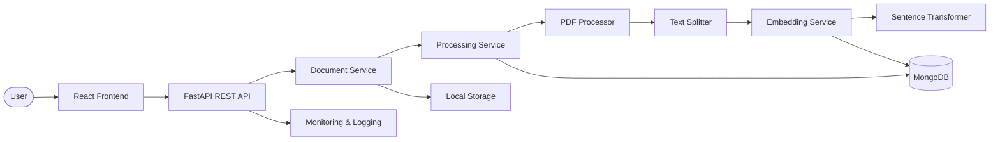
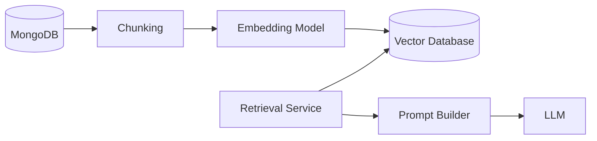

# Document Intelligence Platform

An AI-powered platform for understanding, analyzing, and extracting knowledge from unstructured documents using Large Language Models (LLMs).

## Table of Contents

- [Project Overview](#project-overview)
- [Motivation](#motivation)
- [Project Goals](#project-goals)
- [Key Features](#key-features)
- [System Architecture](#system-architecture)
- [Architecture Overview](#architecture-overview)
- [Document Processing Pipeline](#document-processing-pipeline)
- [Technology Stack](#technology-stack)
- [Project Structure](#project-structure)
- [Roadmap](#roadmap)
- [Installation](#installation)
- [API Overview](#api-overview)
- [Future Improvements](#future-improvements)

## Project Overview

Document Intelligence Platform is a full-stack AI application designed to transform unstructured documents into structured, searchable knowledge.

The platform currently allows users to upload PDF documents and automatically processes their content through text extraction, chunking, and embedding generation. The architecture is designed to evolve towards semantic search and Retrieval-Augmented Generation (RAG).

The project follows modern software engineering and LLMOps principles, emphasizing modularity, maintainability, and clear separation of responsibilities. The architecture is intentionally designed to allow future integration of Retrieval-Augmented Generation (RAG), vector databases, semantic search, and additional AI capabilities without requiring major architectural changes.

This repository represents both a learning project and a production-inspired software architecture built to explore modern AI application development using React, FastAPI, MongoDB, Docker, and open-source AI models.

## Motivation

Organizations generate and manage an increasing number of digital documents every day, including contracts, invoices, reports, resumes, and technical documentation. While storing these documents is straightforward, efficiently understanding and extracting valuable information from them remains a significant challenge.

Traditional document management systems primarily focus on storage and retrieval, requiring users to manually search through documents to locate relevant information. This process is often time-consuming, repetitive, and difficult to scale as document collections grow.

Recent advances in Large Language Models (LLMs) have introduced new possibilities for document understanding. Instead of simply storing files, modern AI systems can classify documents, extract structured information, generate concise summaries, and transform unstructured text into meaningful knowledge.

The goal of this project is to explore these capabilities by designing and implementing a modern Document Intelligence Platform. Beyond experimenting with LLMs, the project emphasizes software architecture, modular design, and maintainability by following principles inspired by modern LLMOps and scalable backend development.

The platform is intentionally designed to evolve over time, allowing future integration of advanced AI capabilities such as Retrieval-Augmented Generation (RAG), semantic search, vector databases, and conversational interaction with document collections.

## Project Goals

The primary goal of this project is to design and implement a modern AI-powered Document Intelligence Platform while applying software engineering best practices and gaining hands-on experience with Large Language Models (LLMs).

The project focuses not only on building functional AI features, but also on designing a scalable and maintainable architecture inspired by modern LLMOps principles.

The main objectives are:

- Build a modular client-server architecture with clearly separated responsibilities.
- Explore the integration of Large Language Models into real-world software applications.
- Automatically transform unstructured documents into structured and meaningful knowledge.
- Implement an extensible document processing pipeline capable of supporting multiple AI tasks.
- Design the system with future support for Retrieval-Augmented Generation (RAG), semantic search, and conversational document interaction.
- Gain practical experience with modern technologies including React, FastAPI, MongoDB, Docker, and open-source AI models.
- Develop a production-inspired portfolio project that emphasizes clean architecture, maintainability, and extensibility over a simple proof of concept.

## Key Features

### Document Processing

- Upload PDF documents.
- Extract text from PDF files.
- Split extracted text into overlapping chunks.
- Preserve page and chunk metadata.
- Track document processing status.
- Store processed document data in MongoDB.

### Embedding Generation

- Generate vector embeddings for document chunks.
- Use Sentence Transformers with the `all-MiniLM-L6-v2` model.
- Store generated embeddings together with chunk data.

### Software Engineering

- Modular client-server architecture.
- RESTful API built with FastAPI.
- Repository-Service architecture.
- Local document storage.
- Automated tests using Pytest.
- Logging and request monitoring.
- Clear separation of responsibilities across processing components.

### Planned AI Capabilities

- OCR support for scanned documents.
- Vector Database integration.
- Retrieval-Augmented Generation (RAG).
- Semantic document search.
- Chat with your documents.
- Support for multiple LLM providers.
- Local LLM inference using Ollama.

## System Architecture

The platform follows a modular client-server architecture inspired by modern software engineering and LLMOps principles.

Each component has a single responsibility and communicates through well-defined interfaces, making the system easier to maintain, extend, and evolve.

The frontend communicates with the backend through a REST API. The backend orchestrates the document processing workflow while delegating specialized processing tasks to dedicated services.

The current document processing pipeline extracts text from PDF files, splits the extracted content into chunks, generates vector embeddings for those chunks, and stores the resulting data in MongoDB.

The architecture is intentionally designed to support future integration of Retrieval-Augmented Generation (RAG), vector databases, and local LLM inference without requiring major architectural changes.



### Future Architecture

The system has been designed with extensibility in mind. The current pipeline already includes document chunking and embedding generation. Future versions will introduce a vector database and semantic retrieval to enable Retrieval-Augmented Generation (RAG).



## Architecture Overview

The application follows a modular client-server architecture where each component is responsible for a single task. This separation of responsibilities improves maintainability, scalability, and makes the system easier to extend with new AI capabilities.

### React Frontend

The frontend provides the user interface of the application. It will allow users to upload documents, monitor processing status, and interact with AI-generated results. The frontend communicates with the backend through REST APIs and remains independent of the underlying processing implementation.

### FastAPI REST API

The REST API acts as the entry point of the system. It receives client requests, validates input data, and forwards requests to the document processing pipeline.

### Document Service

The Document Service coordinates document upload and persistence. It stores uploaded files locally, creates document metadata, and initiates the document processing workflow.

### Processing Service

The Processing Service orchestrates the document processing workflow. It coordinates PDF text extraction, text chunking, embedding generation, chunk persistence, and document status updates.

### PDF Processor

The PDF Processor extracts text from digital PDF documents and preserves the text of individual pages for page-aware processing.

### Text Splitter

The Text Splitter divides extracted document text into overlapping chunks.

Each chunk contains metadata such as the document identifier, chunk index, page number, and character count. Chunk overlap helps preserve contextual continuity between neighboring chunks.

### Embedding Service

The Embedding Service converts document chunks into numerical vector representations.

It uses an embedding model abstraction so that the underlying embedding implementation can be replaced without changing the rest of the processing pipeline.

### Sentence Transformer Embedding Model

The current embedding implementation uses Sentence Transformers with the `all-MiniLM-L6-v2` model.

The generated embeddings are stored together with the corresponding document chunks and will later be used for semantic retrieval.

### MongoDB

MongoDB serves as the primary data store of the application.

It currently stores document metadata, extracted text, processing status, document chunks, chunk metadata, and generated embeddings.

### Local Storage

The local storage component is responsible for storing uploaded document files on the local filesystem while MongoDB stores their metadata and processed content.

### Monitoring & Logging

The monitoring component records request execution information, including HTTP methods, paths, response statuses, and execution times.

These logs help debug the application and monitor the behavior of the processing pipeline.

### Future RAG Extension

The architecture has been intentionally designed to support Retrieval-Augmented Generation (RAG).

The current pipeline already provides the first required components:

- Document chunking.
- Embedding generation.

The next stages will introduce a vector database and semantic retrieval. Retrieved document chunks will later be provided as context to an LLM through a prompt-building layer.

## Technology Stack

The project is built using modern technologies that support modular software architecture, AI integration, and future scalability.

| Layer | Technology | Purpose |
|--------|------------|---------|
| Frontend | React + TypeScript | Builds the user interface and communicates with the backend through REST APIs. |
| Backend | FastAPI | Implements the REST API and orchestrates the document processing pipeline. |
| Database | MongoDB | Stores documents, extracted text, chunks, metadata, and embeddings. |
| Document Processing | PyMuPDF | Extracts text from PDF documents. |
| Text Processing | Custom Text Splitter | Splits extracted text into overlapping chunks while preserving metadata. |
| Embedding Model | Sentence Transformers | Generates vector embeddings for document chunks. |
| Embedding Model | `all-MiniLM-L6-v2` | Current sentence embedding model used by the platform. |
| Testing | Pytest | Provides automated tests for document processing components and services. |
| Containerization | Docker & Docker Compose | Creates a consistent and reproducible development environment. |
| Version Control | Git & GitLab | Source code management and version control. |

### Planned Technologies

The following technologies are planned for future versions of the project:

| Technology | Purpose |
|------------|---------|
| Vector Database | Stores document embeddings for semantic retrieval. |
| Retrieval-Augmented Generation (RAG) | Enhances LLM responses by retrieving relevant document context before inference. |
| Ollama | Local LLM inference without relying on cloud providers. |
| OCR (Tesseract or equivalent) | Extracts text from scanned documents and images. |
| LLM Provider | Provides access to language models for document understanding and generation. |

## Roadmap

The project is being developed incrementally, with each milestone introducing new capabilities while preserving a modular and maintainable architecture.

### Milestone 1 — Project Foundation

- [ ] Initialize React frontend
- [x] Initialize FastAPI backend
- [x] Configure MongoDB
- [ ] Configure Docker environment
- [x] Create project architecture
- [x] Implement document upload
- [x] Store uploaded document metadata

---

### Milestone 2 — Document Processing Pipeline

- [x] Extract text from PDF documents
- [ ] Support DOCX documents
- [ ] Support TXT documents
- [x] Implement document processing workflow
- [x] Save extracted text in MongoDB
- [x] Add processing status tracking
- [x] Implement text chunking
- [x] Preserve chunk metadata
- [x] Generate embeddings for document chunks
- [x] Add automated tests for the processing pipeline

---

### Milestone 3 — AI Document Intelligence

- [ ] Integrate an LLM provider
- [ ] Implement Prompt Builder
- [ ] Document classification
- [ ] Information extraction
- [ ] Document summarization
- [ ] Keyword generation
- [ ] Metadata extraction
- [ ] Store AI-generated knowledge

---

### Milestone 4 — User Experience

- [ ] Processing progress indicators
- [ ] Document history
- [ ] AI result visualization
- [ ] Error handling
- [ ] Improved UI/UX
- [ ] Responsive interface

---

### Milestone 5 — Observability

- [x] Logging
- [x] Request monitoring
- [ ] Processing metrics
- [ ] Error reporting
- [ ] Performance monitoring

---

### Milestone 6 — Future AI Capabilities

- [ ] OCR support
- [x] Embedding generation using Sentence Transformers
- [ ] Vector Database integration
- [ ] Retrieval-Augmented Generation (RAG)
- [ ] Semantic document search
- [ ] Chat with documents
- [ ] Local inference using Ollama
- [ ] Multiple LLM providers

---

### Milestone 7 — Production Readiness

- [ ] Authentication & authorization
- [ ] Role-based access control
- [ ] API documentation
- [x] Automated testing
- [ ] CI/CD pipeline
- [ ] Deployment

## Current Status

> **Current milestone:** Document Processing Pipeline

The backend foundation and initial document processing pipeline have been successfully implemented.

Implemented so far:

- FastAPI application structure
- MongoDB integration
- Configuration management
- Logging and request monitoring
- Repository-Service architecture
- Document upload
- Local file storage
- PDF text extraction
- Page-aware text chunking
- Chunk metadata persistence
- Document processing status tracking
- Sentence Transformers embedding generation
- Embedding persistence
- Automated tests for core processing components

The next step is to integrate a vector database and implement semantic retrieval as the foundation for the Retrieval-Augmented Generation (RAG) pipeline.

## Installation

The backend currently requires Python 3.12 and Poetry for dependency management.

```bash
cd backend
poetry install
```

Create a `.env` file based on `.env.example` and configure the MongoDB connection and local storage path.

Start the FastAPI application with:

```bash
poetry run uvicorn app.main:app --reload
```

The API documentation is available through Swagger UI at:

```text
http://127.0.0.1:8000/docs
```

## API Overview

### Health Check

```http
GET /health
```

Returns the current API health status.

### Upload Document

```http
POST /documents/upload
```

Uploads a PDF document and starts the document processing pipeline.

The processing pipeline currently performs:

1. File storage.
2. Document metadata persistence.
3. PDF text extraction.
4. Text chunking.
5. Embedding generation.
6. Chunk persistence.
7. Document status update.

### Get Document

```http
GET /documents/{document_id}
```

Returns document metadata and processing status.

### Get Document Chunks

```http
GET /documents/{document_id}/chunks
```

Returns the chunks generated for a document, including their metadata and embeddings.

## Future Improvements

The project will continue to evolve towards a complete Retrieval-Augmented Generation (RAG) system.

Planned improvements include:

- Vector database integration.
- Semantic similarity search.
- Retrieval service.
- Prompt Builder.
- LLM integration.
- Retrieval-Augmented Generation.
- Semantic document search.
- Conversational interaction with documents.
- OCR support for scanned documents.
- Multiple document formats.
- Local LLM inference using Ollama.
- Authentication and authorization.
- CI/CD and deployment.