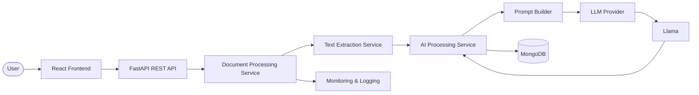
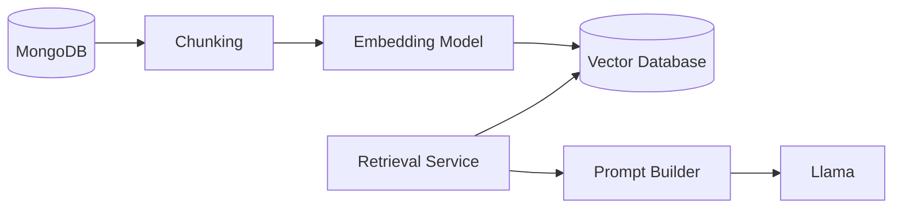

# Document Intelligence Platform

An AI-powered platform for understanding, analyzing, and extracting knowledge from unstructured documents using Large Language Models (LLMs).

## Table of Contents

- [Project Overview](#project-overview)
- [Motivation](#motivation)
- [Project Goals](#project-goals)
- [Key Features](#key-features)
- [System Architecture](#system-architecture)
- [Architecture Overview](#architecture-overview)
- [Document Processing Pipeline](#document-processing-pipeline)
- [Technology Stack](#technology-stack)
- [Project Structure](#project-structure)
- [Roadmap](#roadmap)
- [Installation](#installation)
- [API Overview](#api-overview)
- [Future Improvements](#future-improvements)

## Project Overview

Document Intelligence Platform is a full-stack AI application designed to transform unstructured documents into structured, searchable knowledge.

The platform enables users to upload documents such as PDF, DOCX, or TXT files and automatically analyzes their content using Large Language Models (LLMs). Instead of simply generating text, the application focuses on understanding documents by extracting meaningful information, generating summaries, classifying document types, and creating structured metadata.

The project follows modern software engineering and LLMOps principles, emphasizing modularity, maintainability, and clear separation of responsibilities. The architecture is intentionally designed to allow future integration of Retrieval-Augmented Generation (RAG), vector databases, semantic search, and additional AI capabilities without requiring major architectural changes.

This repository represents both a learning project and a production-inspired software architecture built to explore modern AI application development using React, FastAPI, MongoDB, Docker, and Llama.

## Motivation

Organizations generate and manage an increasing number of digital documents every day, including contracts, invoices, reports, resumes, and technical documentation. While storing these documents is straightforward, efficiently understanding and extracting valuable information from them remains a significant challenge.

Traditional document management systems primarily focus on storage and retrieval, requiring users to manually search through documents to locate relevant information. This process is often time-consuming, repetitive, and difficult to scale as document collections grow.

Recent advances in Large Language Models (LLMs) have introduced new possibilities for document understanding. Instead of simply storing files, modern AI systems can classify documents, extract structured information, generate concise summaries, and transform unstructured text into meaningful knowledge.

The goal of this project is to explore these capabilities by designing and implementing a modern Document Intelligence Platform. Beyond experimenting with LLMs, the project emphasizes software architecture, modular design, and maintainability by following principles inspired by modern LLMOps and scalable backend development.

The platform is intentionally designed to evolve over time, allowing future integration of advanced AI capabilities such as Retrieval-Augmented Generation (RAG), semantic search, vector databases, and conversational interaction with document collections.

## Project Goals

The primary goal of this project is to design and implement a modern AI-powered Document Intelligence Platform while applying software engineering best practices and gaining hands-on experience with Large Language Models (LLMs).

The project focuses not only on building functional AI features, but also on designing a scalable and maintainable architecture inspired by modern LLMOps principles.

The main objectives are:

- Build a modular client-server architecture with clearly separated responsibilities.
- Explore the integration of Large Language Models into real-world software applications.
- Automatically transform unstructured documents into structured and meaningful knowledge.
- Implement an extensible document processing pipeline capable of supporting multiple AI tasks.
- Design the system with future support for Retrieval-Augmented Generation (RAG), semantic search, and conversational document interaction.
- Gain practical experience with modern technologies including React, FastAPI, MongoDB, Docker, and open-source LLMs.
- Develop a production-inspired portfolio project that emphasizes clean architecture, maintainability, and extensibility over a simple proof of concept.

## Key Features

### Document Management

- Upload documents in multiple formats (PDF, DOCX, TXT).
- Manage uploaded documents through a simple and intuitive interface.
- Track document processing status.

### AI-Powered Document Understanding

- Automatic document classification.
- Structured information extraction.
- AI-generated document summaries.
- Automatic keyword generation.
- Metadata extraction for improved document organization.

### Modular AI Pipeline

- Independent document processing pipeline.
- Dedicated text extraction service.
- Centralized AI processing service.
- Prompt Builder for reusable prompt engineering.
- LLM abstraction layer supporting multiple providers.

### Knowledge Management

- Store AI-generated knowledge inside MongoDB.
- Organize extracted information in a structured format.
- Preserve document metadata and AI outputs for future analysis.

### Software Engineering

- Modular client-server architecture.
- RESTful API built with FastAPI.
- React-based frontend.
- Docker-ready development environment.
- Clear separation of responsibilities across all components.

### Planned Features

- OCR support for scanned documents.
- Retrieval-Augmented Generation (RAG).
- Vector Database integration.
- Semantic document search.
- Chat with your documents.
- Support for multiple LLM providers.
- Local LLM inference using Ollama.

## System Architecture

The platform follows a modular client-server architecture inspired by modern software engineering and LLMOps principles.

Each component has a single responsibility and communicates through well-defined interfaces, making the system easier to maintain, extend, and evolve.

The frontend communicates with the backend through a REST API. The backend orchestrates the complete document processing workflow while delegating specialized AI-related tasks to dedicated services.

The architecture is intentionally designed to support future integration of Retrieval-Augmented Generation (RAG), vector databases, and local LLM inference without requiring major architectural changes.

### Future Architecture

The system has been designed with extensibility in mind. Future versions will introduce Retrieval-Augmented Generation (RAG) by integrating embeddings and a vector database while preserving the existing architecture.

## Architecture Overview

The application follows a modular client-server architecture where each component is responsible for a single task. This separation of responsibilities improves maintainability, scalability, and makes the system easier to extend with new AI capabilities.

### React Frontend

The frontend provides the user interface of the application. Users can upload documents, monitor the processing status, and visualize the AI-generated results. The frontend communicates exclusively with the backend through REST APIs and remains independent of the underlying AI implementation.

### FastAPI REST API

The REST API acts as the entry point of the system. It receives client requests, validates input data, and forwards the requests to the document processing pipeline. This layer exposes a clean interface between the frontend and the backend services.

### Document Processing Service

The Document Processing Service orchestrates the entire document analysis workflow. It coordinates the execution of the different processing steps, ensuring that documents pass through text extraction, AI analysis, and data persistence in the correct order.

### Text Extraction Service

This service extracts plain text from uploaded documents. Initially, it supports digital PDF, DOCX, and TXT files. The architecture also allows future integration of OCR technologies for scanned documents without affecting the rest of the system.

### Document Intelligence Service

The Document Intelligence Service contains the business logic responsible for understanding document content. It coordinates AI-related tasks such as document classification, information extraction, summarization, keyword generation, and metadata extraction. Instead of interacting directly with the language model, it delegates prompt creation to a dedicated Prompt Builder component.

### Prompt Builder

Prompt engineering is centralized within the Prompt Builder. Its responsibility is to generate optimized prompts based on the requested AI task while hiding prompt construction details from the rest of the application. This design simplifies maintenance and allows prompt improvements without modifying the business logic.

### LLM Provider

The LLM Provider abstracts the communication with external or local language models. By introducing this abstraction layer, the application remains independent of a specific provider. Initially, the project may use cloud-based inference services such as OpenRouter or Groq, while future versions can seamlessly switch to local inference using Ollama.

### Llama

Llama is the Large Language Model responsible for performing document understanding tasks. It receives structured prompts from the Prompt Builder and generates the AI responses used throughout the application.

### MongoDB

MongoDB serves as the primary data store of the application. It stores uploaded documents, extracted text, AI-generated summaries, classifications, metadata, and structured information. The document-oriented model naturally fits the application's data structure and allows flexible schema evolution as new AI capabilities are introduced.

### Monitoring & Logging

The monitoring component records processing events, execution times, errors, and AI interactions. These logs help debug the application, analyze performance, and improve the overall reliability of the system.

### Future RAG Extension

The architecture has been intentionally designed to support Retrieval-Augmented Generation (RAG). Future versions will introduce document chunking, embedding generation, and a vector database to provide additional context to the language model during inference. Because of the modular architecture, these components can be integrated without significant changes to the existing system.

## Technology Stack

The project is built using modern technologies that support modular software architecture, AI integration, and future scalability.

| Layer | Technology | Purpose |
|--------|------------|---------|
| Frontend | React + TypeScript | Builds the user interface and communicates with the backend through REST APIs. |
| Backend | FastAPI | Implements the REST API and orchestrates the document processing pipeline. |
| Database | MongoDB | Stores uploaded documents, extracted text, AI-generated knowledge, and metadata. |
| AI Model | Llama | Performs document understanding tasks such as classification, summarization, and information extraction. |
| LLM Provider | OpenRouter (initially) | Provides access to Llama models through a unified API. The architecture also supports future migration to local inference using Ollama. |
| Prompt Engineering | Prompt Builder | Generates task-specific prompts while keeping prompt logic separate from the business logic. |
| Containerization | Docker & Docker Compose | Creates a consistent and reproducible development environment. |
| Version Control | Git & GitHub | Source code management and collaboration. |

### Planned Technologies

The following technologies are planned for future versions of the project:

| Technology | Purpose |
|------------|---------|
| Ollama | Local LLM inference without relying on cloud providers. |
| Vector Database | Stores document embeddings for semantic retrieval. |
| Embedding Model | Generates vector representations of document chunks for Retrieval-Augmented Generation (RAG). |
| OCR (Tesseract or equivalent) | Extracts text from scanned documents and images. |
| Retrieval-Augmented Generation (RAG) | Enhances LLM responses by retrieving relevant document context before inference. |

## Roadmap

The project is being developed incrementally, with each milestone introducing new capabilities while preserving a modular and maintainable architecture.

### Milestone 1 — Project Foundation

- [ ] Initialize React frontend
- [x] Initialize FastAPI backend
- [x] Configure MongoDB
- [ ] Configure Docker environment
- [x] Create project architecture
- [x] Implement document upload
- [x] Store uploaded document metadata

---

### Milestone 2 — Document Processing Pipeline

- [ ] Extract text from PDF documents
- [ ] Support DOCX documents
- [ ] Support TXT documents
- [ ] Implement document processing workflow
- [ ] Save extracted text in MongoDB
- [ ] Add processing status tracking

---

### Milestone 3 — AI Document Intelligence

- [ ] Integrate Llama through OpenRouter
- [ ] Implement Prompt Builder
- [ ] Document classification
- [ ] Information extraction
- [ ] Document summarization
- [ ] Keyword generation
- [ ] Metadata extraction
- [ ] Store AI-generated knowledge

---

### Milestone 4 — User Experience

- [ ] Processing progress indicators
- [ ] Document history
- [ ] AI result visualization
- [ ] Error handling
- [ ] Improved UI/UX
- [ ] Responsive interface

---

### Milestone 5 — Observability

- [x] Logging
- [x] Request monitoring
- [ ] Processing metrics
- [ ] Error reporting
- [ ] Performance monitoring

---

### Milestone 6 — Future AI Capabilities

- [ ] OCR support
- [ ] Embedding generation
- [ ] Vector Database integration
- [ ] Retrieval-Augmented Generation (RAG)
- [ ] Semantic document search
- [ ] Chat with documents
- [ ] Local inference using Ollama
- [ ] Multiple LLM providers

---

### Milestone 7 — Production Readiness

- [ ] Authentication & authorization
- [ ] Role-based access control
- [ ] API documentation
- [ ] Automated testing
- [ ] CI/CD pipeline
- [ ] Deployment

## Current Status

> **Current milestone:** Project Foundation

The backend foundation has been successfully established.

Implemented so far:

- FastAPI application structure
- MongoDB integration
- Configuration management
- Logging and request monitoring
- Repository-Service architecture
- Document metadata persistence
- Initial document creation endpoint
- Local file storage service

The next step is to implement the complete document upload workflow by storing uploaded files locally while persisting their metadata in MongoDB. Once the upload pipeline is complete, the project will move on to document processing and AI-powered analysis.